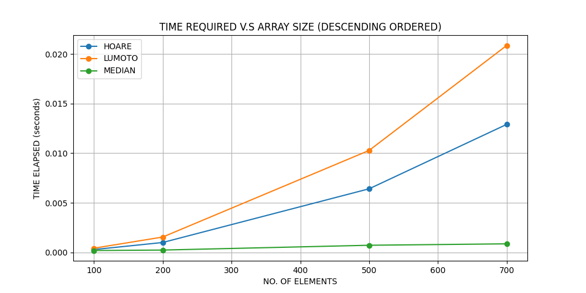

# Improvised QuickSort using Median of 3

### **TIME COMPLEXITY:** O(nlog n)

_(Empirical speedups observed. No theoritcal proof to guaruntee it.)_

### 1) Data in Randomised Order

### 2) Data in Pre-Sorted Order

#### a) Ascending

#### a) Descending

  
*NOTE: We could only run upto 700 array size for pre-sorted experiments as it leads to MaxDepth errors due to our Recursive Implementations. For Randomised elements we ran for 5M samples.

## RESULTS TABLE:

<table>
  <thead>
    <tr>
      <th>Order</th>
      <th>N</th>
      <th>Hoare’s (s)</th>
      <th>Lomuto’s (s)</th>
      <th>MedianOfThree (s)</th>
    </tr>
  </thead>
  <tbody>
  <!-- Ascending group -->
    <tr>
      <td rowspan="4"><strong>Ascending</strong></td>
      <td>100</td><td>0.000398</td><td>0.000624</td><td>0.000069</td>
    </tr>
    <tr>
      <td>200</td><td>0.001081</td><td>0.002367</td><td>0.000108</td>
    </tr>
    <tr>
      <td>500</td><td>0.007308</td><td>0.015038</td><td>0.000303</td>
    </tr>
    <tr>
      <td>700</td><td>0.013399</td><td>0.029529</td><td>0.000367</td>
    </tr>
    <tr>
    <!-- Descending group -->
      <td rowspan="4"><strong>Descending</strong></td>
      <td>100</td><td>0.000289</td><td>0.000424</td><td>0.000186</td>
    </tr>
    <tr>
      <td>200</td><td>0.001022</td><td>0.001582</td><td>0.000229</td>
    </tr>
    <tr>
      <td>500</td><td>0.006462</td><td>0.010338</td><td>0.000691</td>
    </tr>
    <tr>
      <td>700</td><td>0.013427</td><td>0.021096</td><td>0.001068</td>
    </tr>
     <!-- Randomised group -->
      <tr>
        <td rowspan="31"><strong>Randomised</strong></td>
        <td>100</td><td>0.000112</td><td>0.000090</td><td>0.000077</td>
      </tr>
      <tr>
        <td>200</td><td>0.000234</td><td>0.000212</td><td>0.000134</td>
      </tr>
      <tr>
        <td>500</td><td>0.000694</td><td>0.000663</td><td>0.000310</td>
      </tr>
      <tr>
        <td>1000</td><td>0.001467</td><td>0.001343</td><td>0.000699</td>
      </tr>
      <tr>
        <td>2000</td><td>0.003327</td><td>0.002835</td><td>0.001328</td>
      </tr>
      <tr>
        <td>5000</td><td>0.010146</td><td>0.007959</td><td>0.003243</td>
      </tr>
      <tr>
        <td>10000</td><td>0.020873</td><td>0.017986</td><td>0.006429</td>
      </tr>
      <tr>
        <td>25000</td><td>0.055633</td><td>0.052281</td><td>0.016761</td>
      </tr>
      <tr>
        <td>50000</td><td>0.111801</td><td>0.109865</td><td>0.032722</td>
      </tr>
      <tr>
        <td>100000</td><td>0.245582</td><td>0.228898</td><td>0.065775</td>
      </tr>
      <tr>
        <td>250000</td><td>0.631593</td><td>0.655216</td><td>0.160906</td>
      </tr>
      <tr>
        <td>500000</td><td>1.374581</td><td>1.618121</td><td>0.325559</td>
      </tr>
      <tr>
        <td>1000000</td><td>3.130866</td><td>4.688596</td><td>0.655232</td>
      </tr>
      <tr>
      <tr>
        <td>2000000</td><td>6.475708</td><td>14.758546</td><td>1.309490</td>
      </tr>
      <tr>
        <td>5000000</td><td>18.516296</td><td>73.379684</td><td>3.249238</td>
      </tr>
  </tbody>
</table>

## SPEED-UPS

<table border="1" cellpadding="6" cellspacing="0" style="text-align: center;">
    <tr>
      <td rowspan="2">N</td>
      <td colspan="2" >Ascending</td>
      <td colspan="2">Descending</td>
      <td colspan="2">Randomized</td>
    </tr>
    <tr>
      <td>Median vs Hoare</td>
      <td>Median vs Lomuto</td>
      <td>Median vs Hoare</td>
      <td>Median vs Lomuto</td>
      <td>Median vs Hoare</td>
      <td>Median vs Lomuto</td>
    </tr>
    <tr>
      <td>100</td>
      <td>5.76×</td>
      <td>9.03×</td>
      <td>1.55×</td>
      <td>2.27×</td>
      <td>1.46×</td>
      <td>1.16×</td>
    </tr>
    <tr>
      <td>200</td>
      <td>10.05×</td>
      <td>22.01×</td>
      <td>4.46×</td>
      <td>6.90×</td>
      <td>1.75×</td>
      <td>1.59×</td>
    </tr>
    <tr>
      <td>500</td>
      <td>24.09×</td>
      <td>49.57×</td>
      <td>9.35×</td>
      <td>14.95×</td>
      <td>2.24×</td>
      <td>2.14×</td>
    </tr>
    <tr>
      <td>700</td>
      <td>36.48×</td>
      <td>80.40×</td>
      <td>12.57×</td>
      <td>19.76×</td>
      <td>2.48×</td>
      <td>1.95×</td>
    </tr>
</table>

It is clearly evident MedianOfThree obtains massive speed-ups w.r.t. Lumoto and Hoare Algorithms. Also, it exponential faster as the array size scales.

## CONCLUSION

Hence, MedianofThree method offers a faster improvement over the traditional quicksort variants by simply adding a pivot selection step. Empirically, we obtained ~80x speedups(Pre-sorted elements) and ~2.5x(randomised elements) on arrays with just 700 elements. It is clearly evident from the plots that the speedups are supermodular function of array size and we obtained even greater speedups for larger arrays. Potential future works can focus on (1) theoritically prooving the worst case time complexity of the algorithm (2) analysis study on the impact of Median beam (e.g. median-of-5, median-of7, etc) in terms of overhead for pivot selection v.s. performance gains.

With our results, we have successfully determined that the selection of pivot as median enhances the efficiency of the quicksort algorithm.
